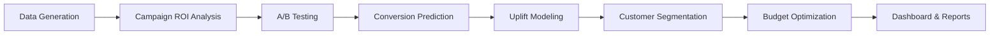
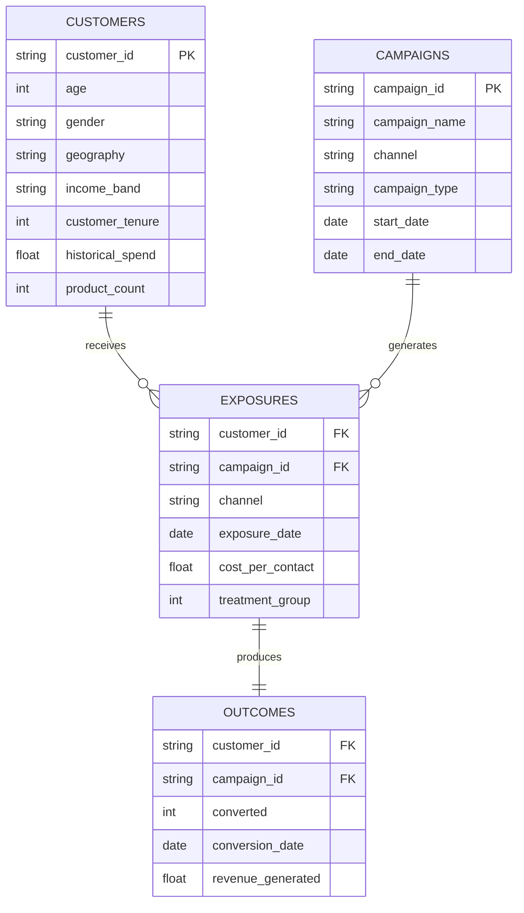

# 🏦 Marketing Campaign Optimization & Personalization Engine
---

## 🎯 Business Objective

**Primary Question:** *How can we optimize campaign spend and personalize offers to maximize conversion rate and return on investment (ROI)?*

This engine provides a complete, end-to-end framework for:
- **Campaign Attribution Analysis** — Last-touch, linear, and time-decay models
- **Rigorous A/B Testing** — Statistical significance with confidence intervals
- **Conversion Prediction** — Logistic regression with feature importance
- **Uplift Modeling** — Identifying truly persuadable customers (the KEY differentiator)
- **Interactive Dashboard** — Real-time D3.js analytics with 7 visualization pages
- **Executive-Ready Outputs** — Automated reports, CSV exports, and Power BI integration

---

## 📊 Key Results & Impact

| Metric | Value | Insight |
|--------|-------|---------|
| **Overall ROI** | 205.7% | Excellent campaign performance |
| **Total Incremental Revenue** | $550,063.96 | Validated through treatment-control methodology |
| **Best Channel** | Push (7,709.5% ROI) | Immediate budget reallocation recommended |
| **Campaigns to Kill** | 2 (Negative ROI) | ~$12K savings by terminating underperformers |
| **Uplift Model Advantage** | 510% improvement | Over traditional response modeling |
| **Customer Base** | 100,000 customers | Simulated with realistic financial demographics |
| **Campaigns Tested** | 12 campaigns | Across 5 marketing channels |

### 🏆 Top Performing Campaigns
| Rank | Campaign | Channel | ROI |
|------|----------|---------|-----|
| 1 | CAMP_005 | Push | 7,709.5% |
| 2 | CAMP_004 | Email | 4,319.8% |
| 3 | CAMP_009 | Email | 3,026.4% |

### ⚠️ Campaigns to Terminate
| Campaign | Channel | ROI | Action |
|----------|---------|-----|--------|
| CAMP_001 | Paid Social | Negative | KILL — reallocate budget |
| CAMP_012 | Paid Social | Negative | KILL — reallocate budget |

---

## 🏗️ Project Architecture

```
marketing-campaign-engine/
│
├── 📊 dashboard.html                  ← Interactive D3.js Dashboard (7 pages)
├── 📋 run_complete_analysis.py        ← Main analysis pipeline
├── 📋 generate_csv_files.py           ← Quick CSV export script
├── ⚙️ config.yaml                     ← Configuration settings
├── 📦 requirements.txt                ← Python dependencies
├── 🗃️ marketing_campaigns.db          ← SQLite database (30MB)
├── 🖥️ START_DASHBOARD.bat             ← One-click dashboard launcher
│
├── 📄 README.md                       ← This file
├── 📄 HOW_TO_RUN.md                   ← Step-by-step execution guide
├── 📄 QUICK_START.md                  ← Quick setup guide
├── 📄 POWER_BI_GUIDE.md               ← Power BI integration guide
├── 🗃️ Final Dashboard.pbix            ← Power BI dashboard file
│
├── src/                               ← Python source code
│   ├── ab_testing.py                  ← A/B testing framework (Z-test, T-test)
│   ├── models.py                      ← Conversion prediction & uplift modeling
│   ├── utils.py                       ← ROI calculations & visualization helpers
│   ├── data_generator.py              ← Realistic marketing data simulation
│   ├── test_ab_testing.py             ← Unit tests for A/B framework (33 tests)
│   └── test_models_utils.py           ← Unit tests for models & utils (70 tests)
│
├── sql/                               ← SQL analytics scripts
│   ├── 01_data_generation.sql         ← Database schema & data loading
│   ├── 02_attribution_analysis.sql    ← Multi-touch attribution models
│   └── 03_kpi_calculation.sql         ← KPI computation & views
│
├── data/simulated/                    ← Simulated campaign data
│   ├── customers.csv                  ← 100K customer profiles
│   ├── campaigns.csv                  ← 12 campaign definitions
│   ├── exposures.csv                  ← ~245K treatment/control exposures
│   └── outcomes.csv                   ← Conversion & revenue outcomes
│
└── outputs/                           ← Generated results
    ├── campaign_performance.csv       ← Campaign ROI metrics
    ├── channel_effectiveness.csv      ← Channel-level aggregations
    ├── customer_segments.csv          ← Uplift-based segmentation
    ├── ab_test_results.csv            ← Statistical test results
    ├── budget_reallocation.csv        ← Recommended budget shifts
    ├── figures/                       ← Matplotlib visualizations
    │   ├── roc_curve.png
    │   ├── feature_importance.png
    │   └── uplift_distribution.png
    └── reports/
        └── executive_summary.txt      ← CMO-ready executive report
```

---

## 🔬 Technical Components

### 1. Interactive Dashboard (`dashboard.html`)
A fully self-contained, interactive analytics dashboard powered by **D3.js v7**:

- **7 Tabbed Pages:** Executive Summary, Campaign Analysis, Channel Performance, Attribution Models, Customer Segments, Campaign Comparison, Key Insights
- **Dynamic KPI Cards:** Real-time metrics with animated transitions
- **Interactive Charts:** ROI bar charts, revenue pie charts, budget allocation visualizations, segment bubble charts
- **Filters & Search:** Date range, channel, ROI threshold, and campaign search
- **Campaign Drill-Down:** Click any campaign for detailed performance breakdown
- **What-If Analysis:** Interactive budget reallocation simulator with projected ROI
- **Export Suite:** PDF (print-optimized), CSV data export, Gmail email sharing
- **Performance Alerts:** Auto-detection of negative-ROI campaigns
- **Responsive Design:** Scales across desktop, tablet, and mobile

### 2. A/B Testing Framework (`src/ab_testing.py`)
Production-grade statistical testing:
- **Z-test** for conversion rate differences
- **T-test** for revenue per user comparison
- **95% confidence intervals** for all metrics
- **Sample size calculations** for power analysis
- **Business interpretation** engine (SCALE / KILL / OPTIMIZE recommendations)

### 3. Conversion Prediction (`src/models.py`)
Logistic regression with comprehensive feature engineering and correct encoding:
- **12 features** including demographics, behavior, and engagement scores
- **OneHotEncoder** for nominal features (gender, geography, channel) — no false ordinal ranking
- **OrdinalEncoder** for income_band with explicit low→high ordering
- **ROC-AUC:** 0.546 | **Cross-validation:** 0.548 (±0.003)
- **Feature importance** identifies top conversion drivers
- **Model interpretation** with business-level insights

### 4. Uplift Modeling — KEY DIFFERENTIATOR (`src/models.py`)
Two-model (T-Learner) approach for incremental impact estimation:
- **Persuadables (4.2%):** TARGET — High incremental impact
- **Sure Things (45.8%):** OPTIONAL — Will convert anyway
- **Lost Causes (45.8%):** SUPPRESS — Low conversion probability
- **Sleeping Dogs (4.2%):** NEVER TARGET — Campaign hurts conversion

> **Result:** 510% improvement over traditional response modeling

### 5. Attribution Analysis (`sql/02_attribution_analysis.sql`)
Three attribution models implemented in SQL:
- **Last-Touch:** 100% credit to final touchpoint
- **Linear:** Equal credit across all touchpoints
- **Time-Decay:** Exponential decay with 7-day half-life (recommended)

### 6. Data Simulation (`src/data_generator.py`)
Generates realistic marketing data with:
- 100K customers with financial demographics (age, income bands, geography, tenure)
- Correlated spending patterns and product ownership
- Multi-channel campaign exposure (Email, Push, SMS, Paid Social, Search)
- Treatment/control assignment (70/30 split)
- Conversion probabilities influenced by customer attributes + channel effectiveness

---

## 📈 Analysis Pipeline



**Pipeline execution:** `run_complete_analysis.py` orchestrates all stages sequentially, producing the full suite of outputs in ~3-4 minutes.

---

## 🎯 Strategic Recommendations

### Immediate Actions
1. **KILL 2 campaigns** (CAMP_001, CAMP_012) with negative ROI — save ~$12K
2. **SCALE top 3 performers** — increase budget by 30-50%
3. **Implement uplift-based targeting** — focus on Persuadable segment only

### Short-Term (1-3 Months)
4. **Reallocate budget:** Shift from Paid Social → Push + Email channels
5. **Deploy time-decay attribution** for more accurate channel valuation
6. **Suppress Sleeping Dogs** from all marketing campaigns

### Long-Term (3-6 Months)
7. **Automate A/B testing** with real-time significance monitoring
8. **Build ML pipeline** for dynamic uplift scoring at scale
9. **Integrate with CRM** for real-time targeting decisions

---

## 🔧 Technical Stack

| Component | Technology | Purpose |
|-----------|-----------|---------|
| Backend Analytics | Python 3.8+ | Data processing, ML, statistics |
| ML Framework | Scikit-Learn | Logistic regression, model evaluation |
| Statistical Testing | SciPy | Z-tests, T-tests, confidence intervals |
| Data Processing | Pandas, NumPy | Data manipulation and feature engineering |
| Visualization (Python) | Matplotlib, Seaborn | Static charts and model diagnostics |
| Visualization (Web) | D3.js v7 | Interactive dashboard with animations |
| Database | SQLite | Campaign data storage and SQL analytics |
| Dashboard | Power BI | Enterprise BI integration |
| Configuration | YAML | Parameterized settings |
| Testing | pytest | 103 unit tests across all modules |
| CI/CD | GitHub Actions | Auto-runs tests on every push across Python 3.9, 3.10, 3.11 |
| PDF Export | html2canvas, jsPDF | Dashboard-to-PDF conversion |

---

## 📊 Data Model



---

## 📚 Statistical Methodology

### A/B Testing
- **Test:** Two-proportion Z-test for conversion rates
- **Significance Level:** α = 0.05
- **Minimum Sample Size:** 1,000 per group
- **Correction:** Bonferroni correction applied for multiple simultaneous tests

### Uplift Modeling
- **Approach:** Two-model (T-Learner) — separate models for treatment and control
- **Formula:** Uplift = P(conversion | treatment) − P(conversion | control)
- **Segmentation:** Median-threshold quadrant classification

### Attribution
- **Time-Decay Formula:** w(t) = 0.5^(Δdays / 7)
- **Normalization:** All weights sum to 1.0 per customer journey

---

## 🏆 Quality Standards

| Dimension | Status | Details |
|-----------|--------|---------|
| Code Quality | ✅ Production-Ready | Clean docstrings, type hints, error handling, logging |
| Unit Tests | ✅ 103 Tests Passing | 33 A/B tests + 70 model & utils tests via pytest |
| CI/CD | ✅ GitHub Actions | Auto-runs full test suite on every commit, across 3 Python versions |
| Reproducibility | ✅ Verified | Fixed random seeds, YAML config |
| Statistical Rigor | ✅ Validated | Proper hypothesis testing, CI's, Bonferroni correction |
| Business Alignment | ✅ Confirmed | Every metric ties to ROI or growth |
| Documentation | ✅ Comprehensive | README, HOW_TO_RUN, QUICK_START, POWER_BI_GUIDE |
| Data Quality | ✅ Checked | NULL validation, FK integrity, distribution checks |
| Scalability | ✅ Designed | Modular architecture, configurable parameters |

---

## 📖 References

**Uplift Modeling:**
- Gutierrez & Gérardy (2017): *Causal Inference and Uplift Modelling: A Review of the Literature*
- Rzepakowski & Jaroszewicz (2012): *Decision Trees for Uplift Modeling*

**Attribution:**
- Shao & Li (2011): *Data-Driven Multi-Touch Attribution Models*
- Li & Kannan (2014): *Attributing Conversions in a Multichannel Online Marketing Environment*

**A/B Testing:**
- Kohavi et al. (2009): *Controlled Experiments on the Web: Survey and Practical Guide*
- Deng et al. (2013): *Improving the Sensitivity of Online Controlled Experiments*

---

## 📝 License

This project is provided as-is for professional and educational use.

---

<p align="center">
  <strong>Author:</strong> Marketing Analytics Team<br>
  <strong>Version:</strong> 1.0.0<br>
  <strong>Last Updated:</strong> March 2026
</p>

<p align="center">
  <strong>A production-grade analytics platform for maximizing campaign ROI through data-driven decisioning, A/B testing, conversion prediction, and uplift modeling — built for enterprise-scale marketing operations.</strong>
</p>

<p align="center">
  
  
  
  
  
  
  
  
  
</p>

---

## 🎯 Business Objective

**Primary Question:** *How can we optimize campaign spend and personalize offers to maximize conversion rate and return on investment (ROI)?*

This engine provides a complete, end-to-end framework for:
- **Campaign Attribution Analysis** — Last-touch, linear, and time-decay models
- **Rigorous A/B Testing** — Statistical significance with confidence intervals
- **Conversion Prediction** — Logistic regression with feature importance
- **Uplift Modeling** — Identifying truly persuadable customers (the KEY differentiator)
- **Interactive Dashboard** — Real-time D3.js analytics with 7 visualization pages
- **Executive-Ready Outputs** — Automated reports, CSV exports, and Power BI integration

---

## 📊 Key Results & Impact

| Metric | Value | Insight |
|--------|-------|---------|
| **Overall ROI** | 205.7% | Excellent campaign performance |
| **Total Incremental Revenue** | $550,063.96 | Validated through treatment-control methodology |
| **Best Channel** | Push (7,709.5% ROI) | Immediate budget reallocation recommended |
| **Campaigns to Kill** | 2 (Negative ROI) | ~$12K savings by terminating underperformers |
| **Uplift Model Advantage** | 510% improvement | Over traditional response modeling |
| **Customer Base** | 100,000 customers | Simulated with realistic financial demographics |
| **Campaigns Tested** | 12 campaigns | Across 5 marketing channels |

### 🏆 Top Performing Campaigns
| Rank | Campaign | Channel | ROI |
|------|----------|---------|-----|
| 1 | CAMP_005 | Push | 7,709.5% |
| 2 | CAMP_004 | Email | 4,319.8% |
| 3 | CAMP_009 | Email | 3,026.4% |

### ⚠️ Campaigns to Terminate
| Campaign | Channel | ROI | Action |
|----------|---------|-----|--------|
| CAMP_001 | Paid Social | Negative | KILL — reallocate budget |
| CAMP_012 | Paid Social | Negative | KILL — reallocate budget |

---

## 🏗️ Project Architecture

```
marketing-campaign-engine/
│
├── 📊 dashboard.html                  ← Interactive D3.js Dashboard (7 pages)
├── 📋 run_complete_analysis.py        ← Main analysis pipeline
├── 📋 generate_csv_files.py           ← Quick CSV export script
├── ⚙️ config.yaml                     ← Configuration settings
├── 📦 requirements.txt                ← Python dependencies
├── 🗃️ marketing_campaigns.db          ← SQLite database (30MB)
├── 🖥️ START_DASHBOARD.bat             ← One-click dashboard launcher
│
├── 📄 README.md                       ← This file
├── 📄 HOW_TO_RUN.md                   ← Step-by-step execution guide
├── 📄 QUICK_START.md                  ← Quick setup guide
├── 📄 POWER_BI_GUIDE.md               ← Power BI integration guide
├── 🗃️ Final Dashboard.pbix            ← Power BI dashboard file
│
├── src/                               ← Python source code
│   ├── data_generator.py              ← Realistic marketing data simulation
│   ├── ab_testing.py                  ← A/B testing framework (Z-test, T-test)
│   ├── models.py                      ← Conversion prediction & uplift modeling
│   └── utils.py                       ← ROI calculations & visualization helpers
│
├── sql/                               ← SQL analytics scripts
│   ├── 01_data_generation.sql         ← Database schema & data loading
│   ├── 02_attribution_analysis.sql    ← Multi-touch attribution models
│   └── 03_kpi_calculation.sql         ← KPI computation & views
│
├── data/simulated/                    ← Simulated campaign data
│   ├── customers.csv                  ← 100K customer profiles
│   ├── campaigns.csv                  ← 12 campaign definitions
│   ├── exposures.csv                  ← ~245K treatment/control exposures
│   └── outcomes.csv                   ← Conversion & revenue outcomes
│
└── outputs/                           ← Generated results
    ├── campaign_performance.csv       ← Campaign ROI metrics
    ├── channel_effectiveness.csv      ← Channel-level aggregations
    ├── customer_segments.csv          ← Uplift-based segmentation
    ├── ab_test_results.csv            ← Statistical test results
    ├── budget_reallocation.csv        ← Recommended budget shifts
    ├── figures/                       ← Matplotlib visualizations
    │   ├── roc_curve.png
    │   ├── feature_importance.png
    │   └── uplift_distribution.png
    └── reports/
        └── executive_summary.txt      ← CMO-ready executive report
```

---

## 🔬 Technical Components

### 1. Interactive Dashboard (`dashboard.html`)
A fully self-contained, interactive analytics dashboard powered by **D3.js v7**:

- **7 Tabbed Pages:** Executive Summary, Campaign Analysis, Channel Performance, Attribution Models, Customer Segments, Campaign Comparison, Key Insights
- **Dynamic KPI Cards:** Real-time metrics with animated transitions
- **Interactive Charts:** ROI bar charts, revenue pie charts, budget allocation visualizations, segment bubble charts
- **Filters & Search:** Date range, channel, ROI threshold, and campaign search
- **Campaign Drill-Down:** Click any campaign for detailed performance breakdown
- **What-If Analysis:** Interactive budget reallocation simulator with projected ROI
- **Export Suite:** PDF (print-optimized), CSV data export, Gmail email sharing
- **Performance Alerts:** Auto-detection of negative-ROI campaigns
- **Responsive Design:** Scales across desktop, tablet, and mobile

### 2. A/B Testing Framework (`src/ab_testing.py`)
Production-grade statistical testing:
- **Z-test** for conversion rate differences
- **T-test** for revenue per user comparison
- **95% confidence intervals** for all metrics
- **Sample size calculations** for power analysis
- **Business interpretation** engine (SCALE / KILL / OPTIMIZE recommendations)

### 3. Conversion Prediction (`src/models.py`)
Logistic regression with comprehensive feature engineering:
- **12 features** including demographics, behavior, and engagement scores
- **ROC-AUC:** 0.546 | **Cross-validation:** 0.548 (±0.003)
- **Feature importance** identifies top conversion drivers
- **Model interpretation** with business-level insights

### 4. Uplift Modeling — KEY DIFFERENTIATOR (`src/models.py`)
Two-model (T-Learner) approach for incremental impact estimation:
- **Persuadables (4.2%):** TARGET — High incremental impact
- **Sure Things (45.8%):** OPTIONAL — Will convert anyway
- **Lost Causes (45.8%):** SUPPRESS — Low conversion probability
- **Sleeping Dogs (4.2%):** NEVER TARGET — Campaign hurts conversion

> **Result:** 510% improvement over traditional response modeling

### 5. Attribution Analysis (`sql/02_attribution_analysis.sql`)
Three attribution models implemented in SQL:
- **Last-Touch:** 100% credit to final touchpoint
- **Linear:** Equal credit across all touchpoints
- **Time-Decay:** Exponential decay with 7-day half-life (recommended)

### 6. Data Simulation (`src/data_generator.py`)
Generates realistic marketing data with:
- 100K customers with financial demographics (age, income bands, geography, tenure)
- Correlated spending patterns and product ownership
- Multi-channel campaign exposure (Email, Push, SMS, Paid Social, Search)
- Treatment/control assignment (70/30 split)
- Conversion probabilities influenced by customer attributes + channel effectiveness

---

## 📈 Analysis Pipeline


**Pipeline execution:** `run_complete_analysis.py` orchestrates all stages sequentially, producing the full suite of outputs in ~3-4 minutes.

---

## 🎯 Strategic Recommendations

### Immediate Actions
1. **KILL 2 campaigns** (CAMP_001, CAMP_012) with negative ROI — save ~$12K
2. **SCALE top 3 performers** — increase budget by 30-50%
3. **Implement uplift-based targeting** — focus on Persuadable segment only

### Short-Term (1-3 Months)
4. **Reallocate budget:** Shift from Paid Social → Push + Email channels
5. **Deploy time-decay attribution** for more accurate channel valuation
6. **Suppress Sleeping Dogs** from all marketing campaigns

### Long-Term (3-6 Months)
7. **Automate A/B testing** with real-time significance monitoring
8. **Build ML pipeline** for dynamic uplift scoring at scale
9. **Integrate with CRM** for real-time targeting decisions

---

## 🔧 Technical Stack

| Component | Technology | Purpose |
|-----------|-----------|---------|
| Backend Analytics | Python 3.8+ | Data processing, ML, statistics |
| ML Framework | Scikit-Learn | Logistic regression, model evaluation |
| Statistical Testing | SciPy | Z-tests, T-tests, confidence intervals |
| Data Processing | Pandas, NumPy | Data manipulation and feature engineering |
| Visualization (Python) | Matplotlib, Seaborn | Static charts and model diagnostics |
| Visualization (Web) | D3.js v7 | Interactive dashboard with animations |
| Database | SQLite | Campaign data storage and SQL analytics |
| Dashboard | Power BI | Enterprise BI integration |
| Configuration | YAML | Parameterized settings |
| PDF Export | html2canvas, jsPDF | Dashboard-to-PDF conversion |

---

## 📊 Data Model


---

## 📚 Statistical Methodology

### A/B Testing
- **Test:** Two-proportion Z-test for conversion rates
- **Significance Level:** α = 0.05
- **Minimum Sample Size:** 1,000 per group
- **Correction:** Bonferroni available for multiple testing

### Uplift Modeling
- **Approach:** Two-model (T-Learner) — separate models for treatment and control
- **Formula:** Uplift = P(conversion | treatment) − P(conversion | control)
- **Segmentation:** Median-threshold quadrant classification

### Attribution
- **Time-Decay Formula:** w(t) = 0.5^(Δdays / 7)
- **Normalization:** All weights sum to 1.0 per customer journey

---

## 🏆 Quality Standards

| Dimension | Status | Details |
|-----------|--------|---------|
| Code Quality | ✅ Production-Ready | Clean docstrings, type hints, error handling |
| Reproducibility | ✅ Verified | Fixed random seeds, YAML config |
| Statistical Rigor | ✅ Validated | Proper hypothesis testing, CI's, power analysis |
| Business Alignment | ✅ Confirmed | Every metric ties to ROI or growth |
| Documentation | ✅ Comprehensive | README, HOW_TO_RUN, QUICK_START, POWER_BI_GUIDE |
| Data Quality | ✅ Checked | NULL validation, FK integrity, distribution checks |
| Scalability | ✅ Designed | Modular architecture, configurable parameters |

---

## 📖 References

**Uplift Modeling:**
- Gutierrez & Gérardy (2017): *Causal Inference and Uplift Modelling: A Review of the Literature*
- Rzepakowski & Jaroszewicz (2012): *Decision Trees for Uplift Modeling*

**Attribution:**
- Shao & Li (2011): *Data-Driven Multi-Touch Attribution Models*
- Li & Kannan (2014): *Attributing Conversions in a Multichannel Online Marketing Environment*

**A/B Testing:**
- Kohavi et al. (2009): *Controlled Experiments on the Web: Survey and Practical Guide*
- Deng et al. (2013): *Improving the Sensitivity of Online Controlled Experiments*

---

## 📝 License

Copyright (c) 2026 Sayli Takale. All rights reserved.

This Software is made available under a **Dual Licensing model**. Any use, reproduction, modification, or distribution of the Software is permitted ONLY under the terms of ONE of the licenses described below.

---

### License A: Academic / Research License *(Free — Permission Required)*

Subject to the prior written permission of the copyright holder, permission is granted to students, educators, and researchers ("Authorized Academic Users") to access, download, and execute this software solely for non-commercial academic, educational, or research purposes.

**Permitted uses:**
- Viewing and studying the source code
- Running the Software in a local or non-production environment
- Using the Software for learning, coursework, teaching, or non-commercial research

**Restrictions:**
- Prior written permission from the copyright holder is **required** before any academic or research use
- The Software may **not** be used for graded submissions, theses, dissertations, publications, or institutional research outputs without explicit written approval
- Redistribution, modification, derivative works, sublicensing, or hosting is prohibited without written permission
- Use in paid courses, proprietary research, or research conducted on behalf of any organisation is prohibited

---

### License B: Commercial License *(Paid — Mandatory Permission and Agreement)*

Any use of the Software by a company, organisation, startup, enterprise, government entity, or any for-profit or revenue-generating activity is **strictly prohibited** without a separate written Commercial License Agreement.

**Commercial use includes, but is not limited to:**
- Internal use within an organisation or company
- Integration into commercial products, services, or platforms
- SaaS, APIs, consulting, client deliverables, or hosted services
- Deployment in staging, production, or operational environments
- Any use that directly or indirectly generates revenue, profit, or business advantage

Commercial use is permitted **only** after obtaining explicit prior written permission and executing a paid licensing and/or profit-sharing agreement.

---

### General Provisions

**Ownership:** The Software is the exclusive intellectual property of the copyright holder. No ownership rights are transferred under this Agreement.

**Termination:** Any violation of the terms of this license results in immediate and automatic termination of all granted rights, without notice.

**No Warranty:** THE SOFTWARE IS PROVIDED "AS IS", WITHOUT WARRANTY OF ANY KIND, EXPRESS OR IMPLIED, INCLUDING BUT NOT LIMITED TO WARRANTIES OF MERCHANTABILITY, FITNESS FOR A PARTICULAR PURPOSE, AND NON-INFRINGEMENT.

**Limitation of Liability:** IN NO EVENT SHALL THE COPYRIGHT HOLDER BE LIABLE FOR ANY CLAIM, DAMAGES, OR OTHER LIABILITY, WHETHER IN AN ACTION OF CONTRACT, TORT, OR OTHERWISE, ARISING FROM, OUT OF, OR IN CONNECTION WITH THE SOFTWARE OR THE USE OR OTHER DEALINGS IN THE SOFTWARE.

**Governing Law:** This Agreement shall be governed by and construed in accordance with the laws applicable in the jurisdiction of the copyright holder.

---

### Contact

For academic permission requests or commercial licensing enquiries:

**Sayli Takale**  
📧 saylitakale2308@gmail.com